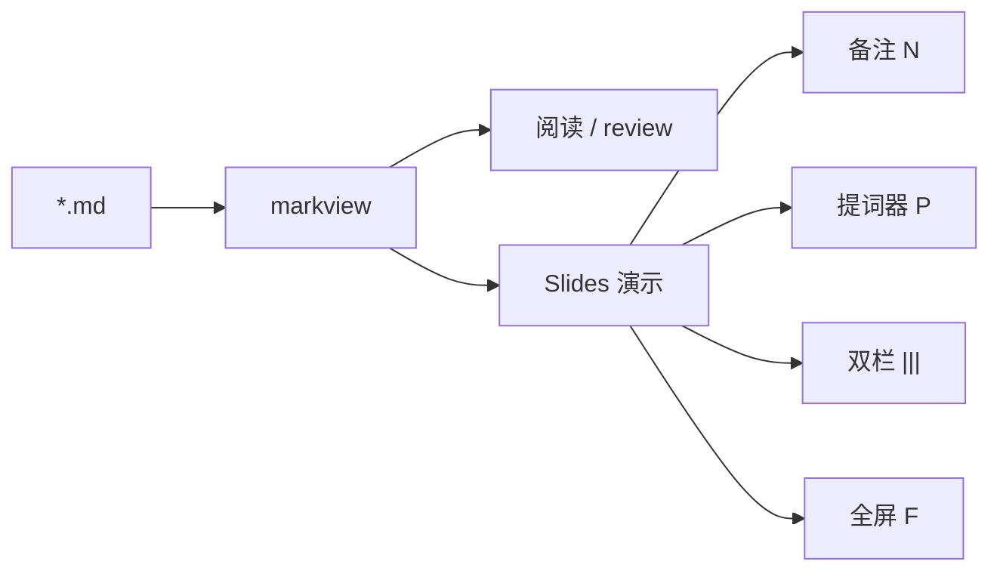

# markview 内置 Slides 完整示例

用右侧 **Slides** 打开本文件，可一次看完当前演示能力。

建议：`markview testdata/slides-complete.md` → 点 **Slides** → `F` 全屏。

快捷键速查：`←/→` 翻页 · `F` 全屏 · `P` 提词器 · `N` 备注 · `H` 固定控件 · `Esc` 退出

<!-- 口播：欢迎大家。先说一句——这是本地优先的 Markdown 展出，不是又一个在线文档。 -->

---

# markview

本地优先的 Markdown 展出

技术分享 · 方案 review · 只读演示

<!-- 口播：停两秒看封面。强调「冷启动就能讲」，别展开架构。 -->

---

## 今天会演示什么

1. 分页与封面
2. 演讲者备注
3. 双栏对比
4. 表格 / 图 / Mermaid
5. 全屏与进度条

> 每页一个主观点；细节放备注里。

---

## 分页规则

- 用单独一行的 `---` 分页
- **代码块里的 `---` 不会分页**
- 每次只渲染当前页

```md
# 第一页

---

# 第二页
```

---

## 演讲者备注

观众只看到要点；备注写在 HTML 注释里。

- 按 `N` 显示 / 隐藏备注面板
- 与 Marp 的注释备注习惯兼容
- 注释不会出现在幻灯片正文中

<!-- 口播：强调「agent 写、markview 展」；不要展开编辑器对比太久 -->

---

## 双栏：本地 vs 在线

### 本地 CLI

- 冷启动即可读
- 尊重 `.gitignore`
- 适合内部分享

|||

### 在线协作

- 多人同时改
- 依赖账号与网络
- 适合对外文档

<!-- 口播：markview 站在左侧；右侧是对照，不是竞品攻击 -->

---

## 三栏也可以

### 写

Agent / 编辑器

|||

### 展

markview Slides

|||

### 存

Git 仓库

---

## 对比表

| 能力       | 阅读模式 | Slides |
| ---------- | -------- | ------ |
| 全文滚动   | ✅       | ❌（分页） |
| 全屏舞台   | ❌       | ✅     |
| 演讲者备注 | ❌       | ✅     |
| 双栏 `\|\|\|` | ❌    | ✅     |

---

## 架构一览



---

## 产品图


配一张图时尽量少字，讲解放备注。

<!-- 口播：logo 页停顿两秒即可 -->

---

## 代码块内的分隔符

下面代码里的 `---` 与 `|||` **不会**触发分页或分栏：

```text
---
this is not a new slide
|||
this is not a column split
```

---

## 常用快捷键

| 操作     | 按键 / 交互        |
| -------- | ------------------ |
| 下一页   | `→` / 空格 / 点击空白 |
| 上一页   | `←`                |
| 全屏     | `F`                |
| 提词器   | `P`（独立窗口）    |
| 备注     | `N`                |
| 固定控件 | `H`                |
| 退出     | `Esc`              |

底部进度条可点击跳页；全屏空闲后控件会自动隐藏。

---

# 谢谢

问题与讨论

<!-- 收尾：导出可用右侧 PDF（Slides 下为多页 deck）；完整示例路径 testdata/slides-complete.md -->
