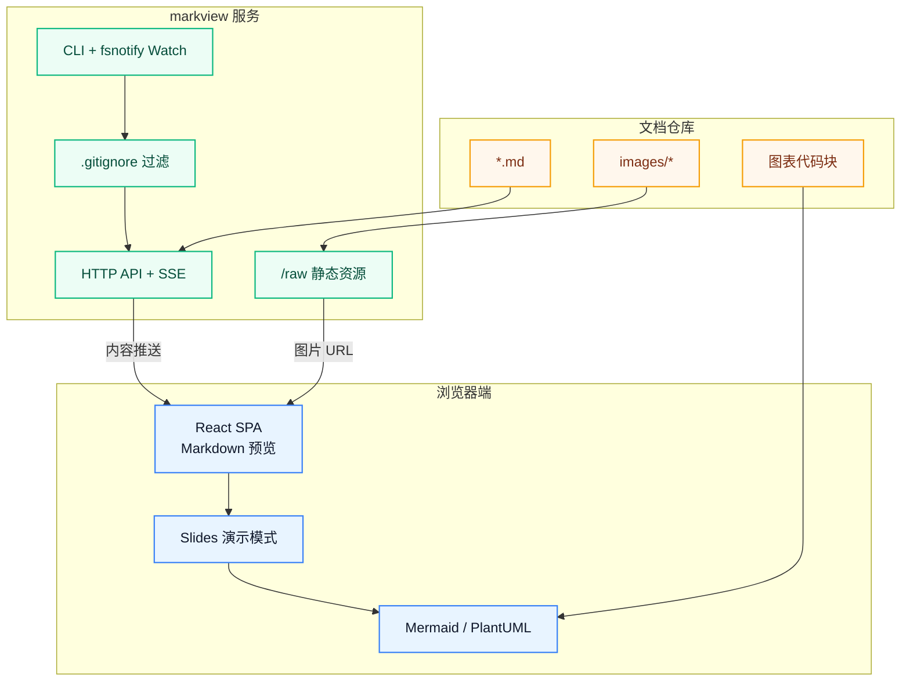

# Slides 媒体页示例

用右侧 **Slides** 按钮查看表格、图片与 Mermaid。

---

## 对比表

| 方案 | 开发成本 | 维护成本 | 推荐 |
| ---- | -------- | -------- | ---- |
| A    | 低       | 中       | ✅   |
| B    | 中       | 低       | ✅   |

---

## 架构图

---

## 产品图

